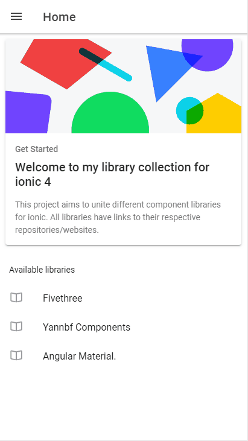

# Ionic 5 Advanced Components

| [Yannbf - Ionic3 Components](https://github.com/yannbf/ionic3-components) | [Agular Material](https://material.angular.io/components/categories) | [Fivethree](https://fivethree-team.github.io/ionic-4-components/) |
| ------------- | ------------- | ------------- |
|   |  |  |


[DEMO](https://vagnersabadi.github.io/awesome-components-ionic/)


Currently this project is using the latest versions of all: Ionic and Angular

****

This repository i made in order to help people learn and speed up their development process.
You will find many many different components, pages, pipes, services, of which can be very useful to you. Note though that these are all experimental!

The content here is a mix of tutorials found online, a few adapted stuff, a few inspired layouts, and also other stuff made by the amazing contributors in the world.

## Setup

Requirements to use this project:

##### Node.js (https://nodejs.org/download/)

##### npm (Node Package Manager, it comes with node.js installation)
In case you're not with the latest version of npm:
```sh
$ sudo npm install npm -g
```

##### Cordova & Ionic Cli
To install both of them on your system just launch this command:
```sh
$ sudo npm install cordova ionic -g
```

## Install NPM Dependencies
Once you clone this repository, run this command on your terminal to install all needed dependencies:
```sh
$ npm install
```

## Install cordova plugin Dependencies
Run this command on your terminal to add a platform and install all needed puglins:

iOS:
```sh
$ ionic cordova platform add ios
$ ionic cordova run ios
```

Android:
```sh
$ ionic cordova platform add android
$ ionic cordova run android
```
## Launching the App
After installing the needed dependencies you are done, launch your app with a simple
```sh
$ ionic serve
```

